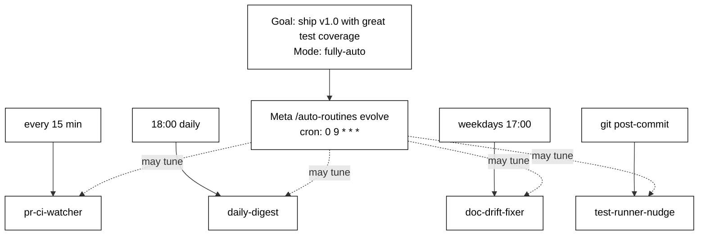

# auto-routines

> **Automation is the best harness.** A discipline agents don't maintain is a harness agents don't have. Let your repo wear the harness for you.

### 1–100 agents, working on your repo 24/7. Seconds to put to work.

```
1.  cd into any repo
2.  answer 4 questions  (90 seconds)
3.  close the laptop
4.  come back to a repo that has been maintaining itself
```

`auto-routines` autoconfigures the harness — routines, hooks, scheduled tasks, real `.git/hooks/post-commit` scripts, PR-comment agents — and from there it runs and evolves *itself*. Pick one of two modes:

- **`fully-auto`** — the meta-agent picks direction from signals alone (CI flake rate, PR queue depth, doc drift, commit cadence). The repo keeps itself healthy.
- **`goal-driven`** — you set an iteration goal. The meta-agent picks routines that close the gap to it.

Every change the meta-agent makes is a git commit. Revert any of them with one command. You stay in the loop via a mermaid plan that's refreshed after every run.

---

## Before vs. after

| | **Before auto-routines** | **After auto-routines** |
|---|---|---|
| Who runs the tests | You, when you remember | A post-commit routine, every commit |
| Who reads the CI log | You, after a Slack ping | A 15-min watcher, comments the failing line on the PR |
| Who writes the daily digest | Nobody — you "will later" | An 18:00 routine, drops it in `.iteration/digests/` |
| Who keeps the README in sync | Nobody — it rots | A weekday drift fixer, opens a PR when it diverges |
| Who removes stale automation | Nobody — it accumulates | The daily meta-agent, neutralizes routines that go quiet |
| Agents working on your repo | 0 | up to 100, on cron / hooks / loops, 24/7 |
| Your job | Hold the discipline yourself | Read the diff in the morning |

---

## Quick start

```bash
git clone https://github.com/paipeline/auto-routines ~/.claude/skills/auto-routines
cd /your/project
claude --dangerously-skip-permissions   # required: routines fire while you're away
> /auto-routines
```

Requires `gh` CLI, Python 3.9+ with `pyyaml`, and the `scheduled-tasks` MCP. The meta-routine and the scheduled tasks all invoke Claude — they only run unattended if Claude is in **auto mode** (no per-tool prompts). Without that, the harness sits there waiting for your approval on every fire.

---

## What it looks like running

```
$ /auto-routines evolve

sanity check: OK
checkpoint: iter-008  (sha 3a1f9c2)

changes:
  + added doc-drift-fixer (cron: 0 17 * * 1-5) — README diverging from src/api/
  ~ retuned pr-ci-watcher 30m → 15m — CI flake rate tripled this week
  - neutralized weekly-dep-audit — 0 useful findings in 11 runs
```



---

## A use case

Three weeks into a side project, the discipline you started with has rotted. Tests skipped, README stale, CI red for two days.

You run `/auto-routines` once. It installs a post-commit nudge, a 15-minute PR watcher, an 18:00 daily digest, a weekday doc-drift fixer, and a daily meta-routine.

By week four the meta-agent has neutralized the drift fixer (no signal), retuned the PR watcher 30m → 15m (CI got flaky), and **added a release-tag-checker on its own** — because it noticed you keep forgetting to bump versions. Each change is `iter-008`, `iter-009`, `iter-010` in your git log.

You never maintained the discipline. The repo did.

---

## Commands

```
/auto-routines              # init if first run, else show status
/auto-routines evolve       # run one iteration (the meta-routine calls this daily)
/auto-routines plan         # re-render plan.mmd
/auto-routines revert iter-007
```

---

## License

MIT — see [LICENSE](LICENSE). If this is useful, star it. PRs welcome.
