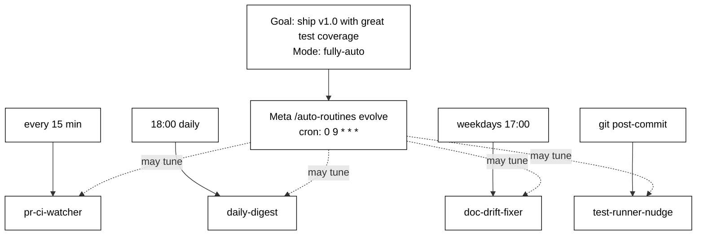

# auto-routines

> **Automation is the best harness.** A discipline you don't maintain is a discipline you don't have. Let your repo wear the harness for you.

### Load. Interview. Leave. It evolves.

```
1.  cd into any repo
2.  answer 4 questions  (90 seconds)
3.  close the laptop
4.  come back to a repo that has been maintaining itself
```

That's it. No config files, no cron syntax, no hand-picking automations. The agent picks them, installs them, watches them, and rewrites the set every day based on what your repo actually needs. You stay in the loop via a mermaid plan refreshed after every run, and every change is a git commit you can revert with one command.

`auto-routines` is a [Claude Code](https://docs.claude.com/claude-code) skill that wires up scheduled tasks, hooks, real `.git/hooks/post-commit` scripts, and PR-comment agents — then keeps tuning them so they stay useful instead of rotting.

---

## Quick start

```bash
git clone https://github.com/paipeline/auto-routines ~/.claude/skills/auto-routines
cd /your/project
claude
> /auto-routines
```

Requires `gh` CLI, Python 3.9+ with `pyyaml`, and the `scheduled-tasks` MCP.

---

## What it looks like running

```
$ /auto-routines evolve

sanity check: OK
checkpoint: iter-008  (sha 3a1f9c2)

changes:
  + added doc-drift-fixer (cron: 0 17 * * 1-5) — README diverging from src/api/
  ~ retuned pr-ci-watcher 30m → 15m — CI flake rate tripled this week
  - neutralized weekly-dep-audit — 0 useful findings in 11 runs
```



---

## A use case

Three weeks into a side project, the discipline you started with has rotted. Tests skipped, README stale, CI red for two days.

You run `/auto-routines` once. It installs a post-commit nudge, a 15-minute PR watcher, an 18:00 daily digest, a weekday doc-drift fixer, and a daily meta-routine.

By week four the meta-routine has neutralized the drift fixer (no signal), retuned the PR watcher 30m → 15m (CI got flaky), and **added a release-tag-checker on its own** — because it noticed you keep forgetting to bump versions. Each change is `iter-008`, `iter-009`, `iter-010` in your git log. Revert any of them with one command.

You never maintained the discipline. The repo did.

---

## Commands

```
/auto-routines              # init if first run, else show status
/auto-routines evolve       # run one iteration (the meta-routine calls this daily)
/auto-routines plan         # re-render plan.mmd
/auto-routines revert iter-007
```

---

## License

MIT — see [LICENSE](LICENSE). If this is useful, star it. PRs welcome.
